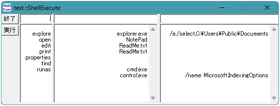

# ShellE

`::ShellExecute` テスト＆検証ユーティリティツール

## 概要

ShellE は、Win32 API の `::ShellExecute` 関数の動作確認およびエラーハンドリング検証を行うためのシンプルな C++ / MFC ダイアログアプリケーションです。

`Operation`（操作）、`File`（実行ファイル/対象）、`Parameters`（引数）を自由に組み合わせ、OS のコントロールパネル項目（「インデックスのオプション」等）や各種プロセスの起動テスト・エラー解析を行うことができます。

## 主な機能

* **`::ShellExecute` 呼び出しテスト**: 各種パラメータをコンボボックスから選択・入力して即座に実行
* **コントロールパネル項目の直接起動**: `control.exe /name Microsoft.IndexingOptions` 等の特殊コマンド検証
* **詳細なエラー処理**: 実行失敗時（戻り値 $\le 32$）に `::GetLastError` および `::FormatMessage` を使用して、OS からの人間が読めるエラーメッセージ文字列を動的に取得・表示

## ビルド方法

本リポジトリには実行ファイル（`ShellE.exe`）は含まれておりません。
お使いの環境に合わせてプロジェクトファイルを開き、ビルドを行ってください。

* **Visual C++ 6.0:** `ShellE.dsp` / `ShellE.dsw`
* **Visual Studio (2005 以降):** `.dsp` ファイルのソリューション変換を行ってビルド

## 使い方

1. ビルドして生成された `ShellE.exe` を起動します。
2. ダイアログ上の各入力項目を設定します：
* **Operation**（操作）: `open`, `edit`, `explore`, `properties` など
* **File**（実行ファイル/対象）: `control.exe`, `explorer.exe`, `notepad.exe` など
* **Parameters**（引数）: `/name Microsoft.IndexingOptions` など

3. **[実行]** ボタンを押します。
4. 起動に失敗した場合は、エラーコードおよび `::FormatMessage` で取得されたエラー詳細メッセージが表示されます。

## 改変・再配布について

本コードは自由に改変してご利用いただけます。改変後のコードを再配布する際は、参照元 URL（ https://mish.work/ ）を必ず明記してください。また、改変後のコードについても本ファイルの免責事項が適用されます。

## 免責事項

本ツールおよび公開しているソースコードの使用により生じたいかなる損害についても、著作者は一切の責任を負いません。ご自身の責任において利用してください。
引用・改変時は上記 URL ( https://mish.work/ ) を明記してください。

---

* **作者:** Iwao ( https://mish.work/ )
* **Copyright:** (C) 2024-2026 Iwao. All Rights Reserved.

